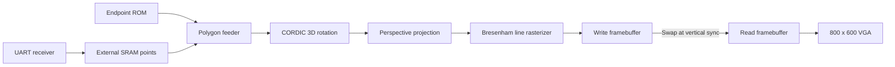

# 🧊 FPGA-Based 3D Graphics Processor

**Authors:** [Sin-Yuan Chao](https://github.com/enzochao0114) and [Min-Lun Tsou](https://github.com/Min-Lun-Tsou)

A FPGA-based graph processor project for the **Terasic DE2-115** board, targeting the **Cyclone IV E EP4CE115F29C7** FPGA. It transforms 3D coordinates with CORDIC rotation and fixed-point perspective projection, draws wireframes with Bresenham's line algorithm, and displays them through ping-pong framebuffers on an **800 × 600 VGA output**.

Geometry comes from an embedded endpoint ROM or points received over UART and stored in external SRAM. The design also includes red/blue stereoscopic views, dashed lines, cycling colors, and brightness effects.

[GitHub repository](https://github.com/enzochao0114/FPGA-Based-3D-Graphics-Processor)

## 🎬 Demos

| Pikachu | Triangle |
| --- | --- |
|  |  |

These recordings are included as demonstrations; the geometry used for every recording is not necessarily present in the current ROM.

## ⚙️ Rendering pipeline



### CORDIC rotation and perspective projection

`Polygon` fetches two endpoints and starts two `Transformer` instances, one per endpoint. Each transformer performs three sequential planar rotations in `Cordic_3d`:

1. Rotate the XY plane using `iAlpha` (about Z).
2. Rotate the YZ plane using `iBeta` (about X).
3. Rotate the ZX plane using `iGamma` (about Y).

`Cordic_Vec` first reduces the angle by quadrant. `Cordic_Vec_Core` then uses shifts, additions, and an arctangent lookup table to rotate the vector. The result is multiplied by a gain compensation constant, `19898 / 32768`, approximately 0.6072. Angles use a 16-bit full-turn representation: `0x4000` corresponds to 90 degrees.

Coordinates are shifted left by three bits before transformation and shifted back afterward. `Perspective` uses `Divider` and fixed-point multiplication to implement the intended projection:

```text
scale = CAMERA_DISTANCE / (CAMERA_DISTANCE + BOX_SIZE / 2 - rotated_z)
projected_x = rotated_x * scale
projected_y = rotated_y * scale
screen_x = 400 + projected_x
screen_y = 300 - projected_y
```

The transformer defaults correspond to a camera distance of 1120 and box size of 600, both scaled by eight internally. `PipeLatch` holds angles, coordinates, and completed endpoint pairs until the next stage consumes them.

With stereoscopic mode enabled, the feeder transforms each line twice with `iGamma ± 520` angle units and selects blue or red for the corresponding view. The output is a wireframe; there is no triangle filling, depth buffer, or hidden-surface removal.

### Bresenham's line algorithm

`modified_linedraw`, defined in `src/DE2_115/DE2_115.sv`, maintains integer X/Y coordinates and an error accumulator. It uses `dx = abs(x1 - x0)`, `dy = -abs(y1 - y0)`, and comparisons against twice the error to decide when to step each coordinate. Each pixel maps to framebuffer address `y * 800 + x`.

Optional dash control gates pixel writes. The current implementation stops when it reaches the endpoint or exceeds the upper screen bounds; it does not implement general line clipping.

### Ping-pong framebuffers

`framebuffer_top_double` instantiates two dual-clock memories, each holding **800 × 600 × 3 bits**. One bit per RGB channel provides eight base colors. Together, the buffers contain 2,880,000 bits of pixel storage before implementation overhead.

The drawing controller clears and writes the inactive buffer while VGA reads the active buffer. After the last line, the animation controller requests a swap. The VGA-domain logic records the request, changes `active_buffer` on the rising edge of the active-low vertical-sync signal, and pulses `swap_complete`. The animation controller waits for this acknowledgment before starting the next frame.

### PLL clocks and clock-domain crossings

The PLL takes the board's 50 MHz clock and generates:

| PLL output | Actual frequency | Use |
| --- | --- | --- |
| `altpll_12m_clk` | 40 MHz | Transformation, UART, animation controller, VGA |
| `altpll_100k_clk` | 100 MHz | Line rasterizer, framebuffer clearing and writes |
| `altpll_800k_clk` | 200 MHz | Unused by the rendering pipeline |

The PLL port names are historical; the generated PLL multiplication/division settings determine these frequencies. VGA uses 1056 × 628 total pixel periods, giving approximately 60.3 Hz at 40 MHz. Display refresh is separate from geometry-rendering throughput.

The memories use separate write and read clocks. The swap request/acknowledgment sequence coordinates frame ownership, but **the current RTL does not provide a complete synchronized CDC handshake**: the request and acknowledgment both run at 40 MHz, while `active_buffer`, drawing commands, and status signals also cross between the 40 MHz and 100 MHz domains without explicit synchronizers. These paths need timing/CDC review before treating the implementation as a fully verified design.

## 🎮 Hardware controls

| Input | Function |
| --- | --- |
| `KEY[0]` | Active-low reset |
| `GPIO[35]` / `GPIO[32]` | Increase / decrease alpha rotation |
| `GPIO[34]` / `GPIO[33]` | Increase / decrease beta rotation |
| `SW[17]` | Enable red/blue stereoscopic rendering |
| `SW[16]` | Select SRAM geometry; low selects ROM |
| `SW[15]` / `SW[14]` | Increase / decrease geometry scale |
| `SW[0]` | Force white lines instead of red/blue |
| `SW[1]` | Enable cycling pixel colors |
| `SW[2]` | Enable dashed lines |
| `SW[3]` | Enable fast brightness modulation |
| `SW[4]` | Enable smooth brightness modulation; takes priority over `SW[3]` |
| `GPIO[9]` | UART serial input |

`HEX1:HEX0` show the animation-controller state. `LEDG[0]` / `LEDR[0]` indicate drawing idle/busy, `LEDG[1]` indicates the animation idle state, `LEDR[1]` indicates a timeout, and `LEDG[2]` toggles after each completed frame.

## 📡 Geometry input

**ROM:** `src/LineRom.v` contains signed 16-bit coordinate words in groups of six: `X1, Y1, Z1, X2, Y2, Z2`. Each group describes an independent line. When replacing the geometry, update both the ROM data and the feeder's `iPointCount` value in the top-level module.

**UART/SRAM:** `receiver.sv` uses 347 clock cycles per bit at 40 MHz, approximately 115200 baud, with eight data bits, no parity, and one stop-bit interval. The serial input is `GPIO[9]`, rather than the board's `UART_RXD` port.

`receiver_decoder` accepts a `0xFF` marker followed by six payload bytes. It shifts bytes into a 48-bit register and writes the least-significant 16-bit word first. To place X, Y, Z in successive SRAM addresses, the resulting packet order is:

```text
FF  Z_hi Z_lo  Y_hi Y_lo  X_hi X_lo
```

Coordinates use signed 16-bit two's-complement values. Each packet appends a point; reset clears the address and point counters. The feeder connects successive SRAM points into segments. There is no host uploader in this repository, and the decoder has no packet queue or flow control while waiting to write SRAM. The write sequence also leaves write-enable asserted for an extra cycle after the three coordinate writes, so this interface needs validation before relying on streamed geometry.

## 📁 Project layout

| Path | Purpose |
| --- | --- |
| `lab3.qpf` | Quartus project; active revision is `DE2_115` |
| `DE2_115.qsf` | Root project settings, device, pins, and source list |
| `src/DE2_115/DE2_115.sv` | Board integration, animation FSM, framebuffers, VGA, and rasterizer |
| `src/Polygon.sv` | Geometry feeder, stereo control, and endpoint buffering |
| `src/Transformer.v` | Rotation and projection integration |
| `src/Cordic_3d.v`, `src/Cordic_Vec.v`, `src/Cordic_Vec_Core.v` | CORDIC rotation stages |
| `src/Perspective.v`, `src/Divider.v`, `src/PipeLatch.v` | Fixed-point projection and pipeline storage |
| `src/LineRom.v` | Built-in line endpoint data |
| `src/receiver.sv`, `src/receive_decoder.sv` | UART reception and SRAM writes |
| `Altpll.qsys`, `Altpll/`, `Altpll.sopcinfo` | PLL configuration and generated integration files |
| `src/DE2_115/DE2_115.sdc` | Existing board clock constraints; not assigned by the root QSF |
| `figure/` | Demo recordings |

`Screen.v`, `VGA.sv`, `ROM.sv`, and some board helper modules are earlier standalone examples and are not in the active root project's source list. The QSF under `src/DE2_115/` is an older board configuration; use the root project for this design.

## 🚀 Build and run

The project files identify **Quartus II 15.0**. Building requires Quartus with Cyclone IV E device support; programming requires a DE2-115 board, USB-Blaster connection, and a compatible VGA display.

1. Clone the repository:

   ```sh
   git clone https://github.com/enzochao0114/FPGA-Based-3D-Graphics-Processor.git
   cd FPGA-Based-3D-Graphics-Processor
   ```

2. Open **`lab3.qpf`** in Quartus. Confirm revision `DE2_115`, top-level entity `DE2_115`, and device `EP4CE115F29C7`.
3. Keep the supplied PLL synthesis files. If regeneration is necessary, open `Altpll.qsys` in Qsys and generate synthesis HDL, checking that its outputs remain 40, 100, and 200 MHz.
4. Review the existing board SDC and add the appropriate clock constraints to the root project. Its current QSF does not reference `src/DE2_115/DE2_115.sdc`; the generated IP constraints alone do not establish complete board timing coverage.
5. Run compilation and inspect warnings, timing results, and memory usage. From a configured Quartus shell, the equivalent compilation command is:

   ```sh
   quartus_sh --flow compile lab3 -c DE2_115
   ```

6. Open Quartus Programmer, select USB-Blaster, and program the newly generated `output_files/DE2_115.sof`.
7. Connect VGA, select ROM input with `SW[16] = 0`, and press/release `KEY[0]` to reset. External rotation controls connect to the GPIO inputs listed above.

SignalTap is disabled in the root project, and references to local capture/programmer sessions have been removed. Build databases, programming outputs, workspace state, and backup files are excluded by `.gitignore`; PLL files required by the project remain included.

## 🔎 Current validation and limitations

This repository preserves the existing hardware logic. The documentation/comment cleanup was checked by comparing RTL tokens with comments and whitespace excluded. No simulation testbench is included, and synthesis, timing closure, and board operation were not revalidated during that cleanup.

In addition to the CDC and UART points above:

- The current ROM defines 954 coordinate words, or **159 line segments**, while the top-level feeder requests **471 segments**. Reads beyond the populated ROM return zero. Align the count with the geometry for a new hardware build.
- Perspective arithmetic has finite precision and no explicit near-plane or divide-by-zero handling. The divider's numerical behavior needs simulation against the intended projection equation.
- Project timing constraints, coordinate clipping, and reset behavior need further verification. The PLL lock signal is not used to qualify the rendering reset.

## 📄 License and copyright

Copyright © 2026 Sin-Yuan Chao and Min-Lun Tsou.

The original project code and documentation are licensed under the [MIT License](LICENSE).

Generated Altera IP files in `Altpll/` retain their original copyright and license terms and are not covered by this MIT license.
